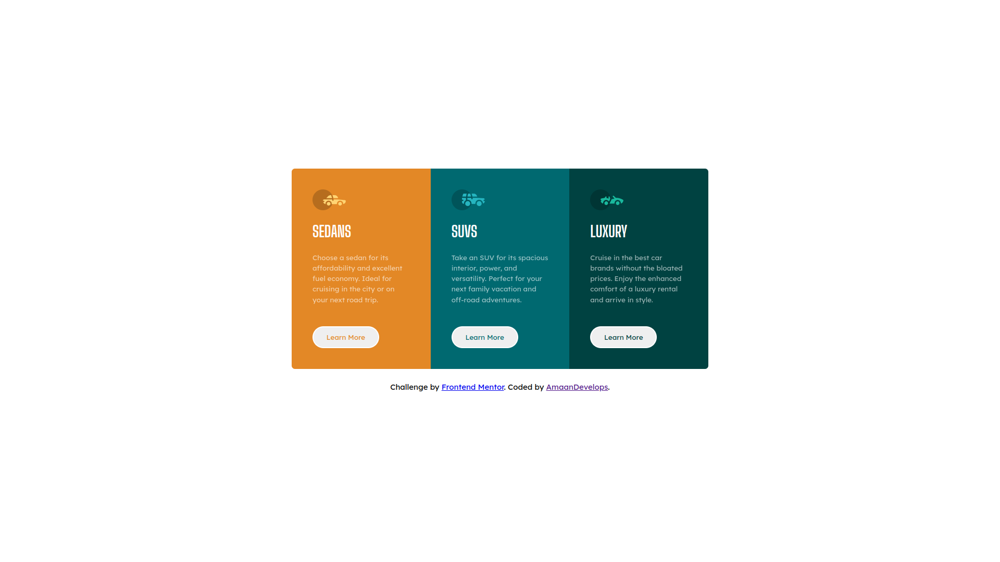

# Frontend Mentor - 3-column preview card component solution

This is a solution to the [3-column preview card component challenge on Frontend Mentor](https://www.frontendmentor.io/challenges/3column-preview-card-component-pH92eAR2-). Frontend Mentor challenges help you improve your coding skills by building realistic projects. 

## Table of contents

- [Overview](#overview)
  - [The challenge](#the-challenge)
  - [Screenshot](#screenshot)
  - [Links](#links)
- [My process](#my-process)
  - [Built with](#built-with)
  - [What I learned](#what-i-learned)
- [Author](#author)

## Overview

### The challenge

Users should be able to:

- View the optimal layout depending on their device's screen size
- See hover states for interactive elements

### Screenshot



### Links

- Solution URL: [Add solution URL here](https://your-solution-url.com)
- Live Site URL: [Add live site URL here](https://your-live-site-url.com)

## My process

### Built with

- Semantic HTML5 markup
- CSS custom properties
- Flexbox
- CSS Grid
- Mobile-first workflow

### What I learned

In this challenge, I learned a few things about ::before and ::after pseudo-selectors.

```css
.cards__card::before {
    content: '';
    width: 64px;
    height: 40px;
}

.cards__card:nth-child(1)::before {
    background-image: url('./images/icon-sedans.svg');
}

.cards__card:nth-child(2)::before {
    background-image: url('./images/icon-suvs.svg');
}

.cards__card:nth-child(3)::before {
    background-image: url('./images/icon-luxury.svg');
}
```

## Author

- Frontend Mentor - [@AmaanDevelops](https://www.frontendmentor.io/profile/amaandevelops)
- Twitter - [@AmaanDevelops](https://www.twitter.com/amaandevelops)
